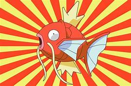

<!DOCTYPE html>
<html>
  <head>
    
   
  </head>
  <body>
    

      <section >
        <h1>About me</h1>
            
Me name is Nekane I'm studing Web Development at Ironhack

            <figure>
            
            </figure>
            <h2>My projects</h2>
            
Here you can find my projects:

            <ul>
                <li><a href="https://nekaneib.github.io/project01_cute-baby-abducer/">Project 1: Cute baby-abducter</a></li>
            </ul>
      </section>

      <footer>
        <a href="contact.html">Contact me</a>
      </footer>
    

  </body>
</html>
